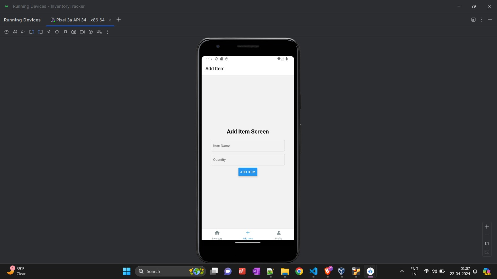

# InventoryTracker

## Team Members:

- Naga Swetha Vempati(M15799695)
- Rahul Kumar Reddy Boggula(M15443795)
- Sai Vyshnavi Kolla(M15891248)

Repository URL : [https://github.com/boggulry/InventoryTracker](https://github.com/boggulry/InventoryTracker)

## Description:

InventoryTracker simplifies inventory management for businesses and individuals alike. Whether you're a small business owner, warehouse manager, or just organizing personal belongings, our app makes tracking and monitoring inventory easy.

Our App mainly consists of three screens - Profile Screen, Inventory Screen and Add Item Screen

-**Profile Screen** - In Profile screen, user can be able to see the count of total items available in their inventory so that the user can be able to know the availablity of their items.

Intially there are no items added to our inventory so the total count will be 0.

-**AddItem Screen** - In this screen the user can be able to add the item to the inventory. User have to give the name of the item and the count available of that item.

-**Inventory Screen** - This is the screen where the user can be able to see the list of items along with their count avialble in inventory to keep track of their records. 

Intially there are no items added to the inventory so it is showing a blank plage. 

We also added a feature to edit values of items as well as to delete any selected item from inventory

Here I am providing with the series of screenshots that will show the functionality of Inventory management in our application.

## Components

### App.js
- The main entry point of the application.
- Configures navigation using `react-navigation`, setting up navigation between the Inventory, Add Item, and Profile screens using `createBottomTabNavigator`.
  
### ProfileScreen.js
- Displays user profile information and total inventory count.
- Calculates the total inventory count by summing up the quantity of all items in the inventory list.
  
### InventoryScreen.js
- Manages the inventory list and related actions.
- Allows users to view, edit, and delete items from the inventory.
- Utilizes a modal for editing items, with options to modify item name and quantity.
- Renders a list of items using `FlatList` and provides functionality to edit or delete items upon selection.
  
### AddItemScreen.js
- Provides a form for users to add new items to the inventory.
- Validates input fields for item name and quantity.
- Calls the `onAddItem` function passed as a prop to add new items to the inventory list.

## Dependencies
- `react-navigation`: Facilitates navigation between screens.
- `@expo/vector-icons`: Provides icon components for UI elements.
- `react-native`: Core library for building mobile applications using React.

## How it Works
- Upon launching the application, users are presented with a tab-based navigation system to access different screens: Inventory, Add Item, and Profile.
- The Inventory screen displays the list of items in the inventory, allowing users to edit or delete existing items.
- Users can add new items to the inventory using the Add Item screen by providing item name and quantity.
- Profile screen shows user profile information, including the total inventory count calculated from the quantity of all items in the inventory.

## Expo Go
- This project was simulated and tested using Expo Go, allowing easy access and testing of the application on iOS and Android devices.

## Future Improvisation and Real World Application of this InventoryTracker App:

In the future, the Inventory Tracker app could be enhanced with features like user authentication for data security, barcode scanning for streamlined item entry, and advanced reporting for insightful analytics. Implementing user authentication would offer personalized experiences and data privacy controls. Barcode scanning functionality would simplify adding items to the inventory, reducing manual errors. Advanced reporting features would provide valuable insights into inventory trends and restocking needs, aiding informed decision-making. Additionally, inventory alerts could notify users of low stock levels or impending expirations, ensuring optimal inventory management. Extending support to multiple platforms would further enhance accessibility and user reach.

The Inventory Tracker app finds practical application across diverse industries. Retailers can optimize inventory turnover and reduce stockouts, while warehouses can streamline inventory movements and minimize shrinkage. Food and beverage establishments can minimize wastage and ensure consistent ingredient supply, while manufacturers can optimize production schedules and reduce lead times. Medical facilities can manage medication inventory efficiently, ensuring adequate stock levels and compliance with regulatory requirements. Overall, the app offers cost savings, operational efficiency, and better decision-making across various sectors.

